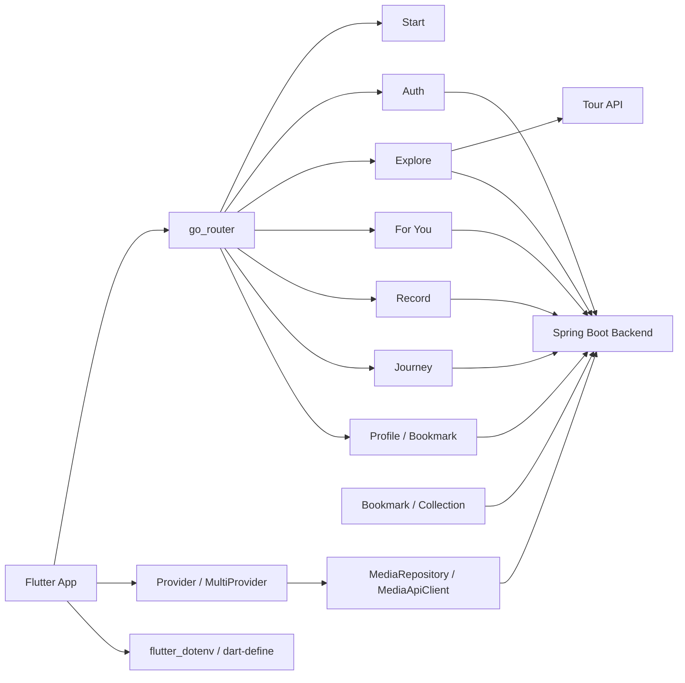

# Heat Trip Flutter

감정과 취향을 기반으로 여행지를 탐색하고, 추천 결과를 일정과 여행 기록으로 연결하는 Heat Trip 서비스의 Flutter 클라이언트입니다.

[](https://flutter.dev/)
[](https://dart.dev/)
[](https://developer.android.com/)
[](https://developer.apple.com/ios/)

## 주요 프로젝트 링크

| 구분 | 역할 | 링크 |
| --- | --- | --- |
| 스토리보드 | 프로젝트 배경, 문제 정의, 결과물 소개 | [Heat Trip Notion](https://app.notion.com/p/Heat-Trip-321b82bc8b718166a51fd382c51d96b5?source=copy_link) |
| 백엔드 | Spring Boot API 서버 | [Heat Trip Backend](https://github.com/sanghyunbang/Heat_Trip_Spring_Boot_BE) |
| 기술 Wiki | 구현 상세, 테스트 결과, 기술 의사결정 기록 | [Backend Wiki](https://github.com/sanghyunbang/Heat_Trip_Spring_Boot_BE/wiki) |

## 프로젝트 소개

Heat Trip Flutter는 사용자가 여행지를 탐색하고, 감정 기반 추천을 받고, 북마크와 일정, 여행 기록까지 관리할 수 있도록 설계된 모바일 앱입니다.

앱은 Spring Boot 백엔드와 REST API로 통신하며, 관광지 상세 정보 일부는 공공데이터포털 Tour API를 사용합니다. 인증은 이메일 로그인과 소셜 로그인 흐름을 고려하고, 로그인 후 발급된 토큰을 이용해 북마크, 컬렉션, 일정, 미디어 업로드 API에 접근합니다.

## 핵심 기능

- 여행지 홈, 테마 카드, 지역/카테고리 기반 탐색
- 여행지 목록, 상세 정보, 이미지 갤러리, 감정/특징 정보 표시
- 감정과 취향 기반 추천 플로우
- 북마크와 컬렉션 기반 장소 저장
- 일정 생성, 조회, 수정, 삭제
- 여행 일지 작성, 상세 보기, 이미지 첨부
- 프로필 조회와 수정
- 이메일 로그인, 회원가입, 소셜 로그인 진입 흐름
- 미디어 선택과 업로드 API 연동 구조

## 앱 구조



## 기술 스택

- Flutter / Dart
- go_router
- provider
- http
- flutter_dotenv
- shared_preferences
- flutter_secure_storage
- flutter_web_auth_2
- image_picker
- geolocator
- cached_network_image
- flutter_svg
- table_calendar

## 디렉터리 구조

```text
lib/
  app/                 # MaterialApp, go_router 설정
  core/                # 공통 설정, 테마, 네트워크, 레이아웃 위젯
  features/
    auth/              # 로그인, 회원가입, 토큰 저장, 소셜 로그인
    explore/           # 여행지 홈, 목록, 상세, 검색, Tour API 연동
    foryou/            # 기존 추천 UI
    foryou_v2/         # 개선된 추천 플로우
    bookmark/          # 북마크, 컬렉션
    record/            # 일정 생성/편집/조회
    journey/           # 여행, 일정, 다이어리
    profile/           # 프로필, 설정, 약관, 피드백
    start/             # 시작 화면
  shared/
    media/             # 미디어 선택, 업로드, 공통 미디어 위젯
assets/
  icons/               # 소셜 로그인 아이콘, 앱 아이콘
  terms/               # 약관/개인정보처리방침/마케팅 문서
```

## 빠른 시작

### 1. Flutter 환경 확인

```bash
flutter doctor
```

이 프로젝트는 Dart SDK `^3.8.1` 환경을 기준으로 합니다.

### 2. 의존성 설치

```bash
flutter pub get
```

### 3. 환경 변수 파일 생성

루트에 `.env` 파일을 만들고 필요한 값을 채웁니다. `.env`는 Git에 커밋하지 않습니다.

```env
API_BASE_URL=https://your-backend.example.com
YOUR_DECODING_SERVICE_KEY=your-public-data-service-key
MOBILE_OS=ETC
MOBILE_APP=HeatTrip
```

`YOUR_DECODING_SERVICE_KEY`는 공공데이터포털 서비스 키입니다. 인코딩된 키와 디코딩된 키를 모두 처리할 수 있도록 앱에서 정규화합니다.

### 4. 앱 실행

Android 에뮬레이터에서 로컬 백엔드를 사용할 때:

```bash
flutter run --dart-define=API_BASE_URL=http://10.0.2.2:8080
```

배포 서버를 사용할 때:

```bash
flutter run --dart-define=API_BASE_URL=https://your-backend.example.com
```

`.env`의 `API_BASE_URL`을 사용할 수도 있지만, 빌드 환경별로 명확히 분리하려면 `--dart-define` 사용을 권장합니다.

## 개발 명령

```bash
flutter analyze
flutter test
dart format lib test
```

앱 아이콘을 다시 생성해야 하는 경우:

```bash
dart run flutter_launcher_icons
```

## 환경 변수

| 이름 | 설명 | 예시 |
| --- | --- | --- |
| `API_BASE_URL` | Spring Boot 백엔드 API 주소 | `https://your-backend.example.com` |
| `YOUR_DECODING_SERVICE_KEY` | 공공데이터포털 Tour API 서비스 키 | 커밋 금지 |
| `MOBILE_OS` | Tour API 요청용 OS 값 | `ETC` |
| `MOBILE_APP` | Tour API 요청용 앱 이름 | `HeatTrip` |

## 보안 메모

- `.env`, keystore, Firebase 설정 파일, 서비스 계정 JSON은 Git에 커밋하지 않습니다.
- Android release signing 파일은 `android/key.properties`와 keystore로 관리하고, 저장소에는 올리지 않습니다.
- 실제 운영 API 주소와 서비스 키는 배포 환경 또는 로컬 `.env`에서 주입합니다.
- public 저장소에서는 secret scan 경고가 나올 수 있는 예시 값을 README에 넣지 않습니다.

## 현재 라우트 개요

| 경로 | 기능 |
| --- | --- |
| `/start` | 시작 화면 |
| `/auth/login` | 로그인 |
| `/auth/sign-up` | 회원가입 |
| `/explore` | 여행지 홈 |
| `/explore/list` | 여행지 목록 |
| `/explore/:contentId/:contentTypeId` | 여행지 상세 |
| `/record` | 일정 |
| `/foryou_v2` | 추천 플로우 |
| `/journey` | 여행/다이어리 |
| `/profile` | 프로필 |
| `/bookmarks` | 북마크 컬렉션 |

## 문서 관리

프론트엔드 구조와 화면별 구현 상세는 각 feature 폴더의 문서와 코드 주석에서 관리합니다. 백엔드 API 계약이 바뀌면 이 README의 환경 변수, 실행 방법, 라우트/기능 설명도 함께 갱신합니다.
